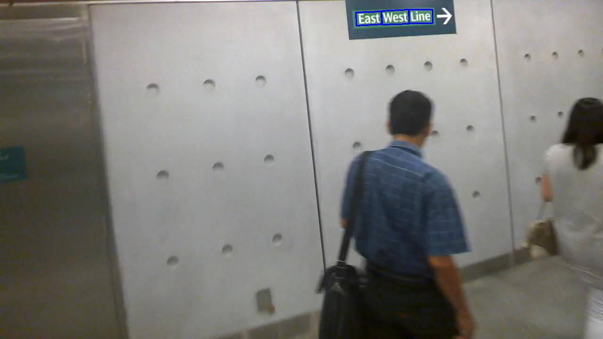

# Real-time Scene Text Detection with Differentiable Binarization

**note**: some code is inherited from [MhLiao/DB](https://github.com/MhLiao/DB)

## update 
2020-12-16: 融合Deeplabv3+中的空洞卷积模型,在使用atros类型的backbone时，需要注意配合SPP的neck类型使用。

## Requirements
* pytorch 1.2+
* torchvision 0.4+
* GTX 1080+

## Data Preparation

Data: put `img` and `gt` folder into `datasets` folder

run `make_list.py` will create `train.txt` and `test.txt` in `dataset` folder 

Training data: text `train.txt` in the following format, use '\t' as a separator

```
./datasets/img/001.jpg	./datasets/gt/001.txt
```

Validation data: text `test.txt` in the following format, use '\t' as a separator
```
./datasets/img/001.jpg	./datasets/gt/001.txt
```
- Store images in the `img` folder
- Store groundtruth in the `gt` folder

The groundtruth can be `.txt` files, with the following format:
```
x1, y1, x2, y2, x3, y3, x4, y4, annotation
```


## Train
1. Set the parameters in `config.py`  , it contains all config context.
```bash
python train.py
```
## Test

[eval.py](eval.py) is used to test model on test dataset

```bash
python eval.py
```

## Predict 
[predict.py](predict.py) Set parameters in local file.

```
python predict.py
```
The project is still under development.



**If this repository helps you，please star it. Thanks.**